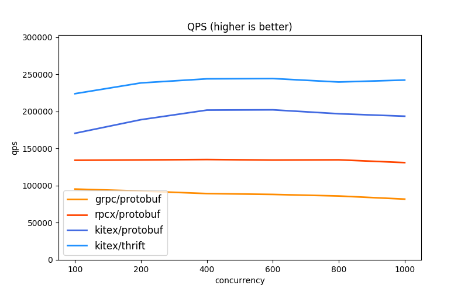
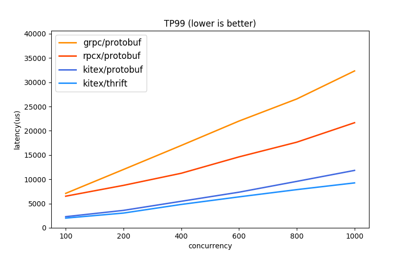
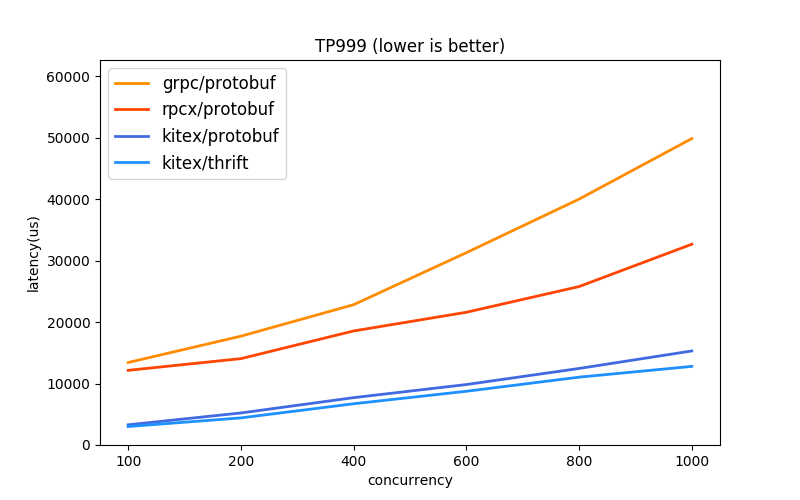
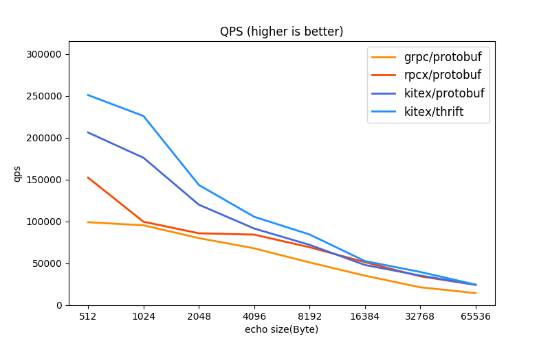
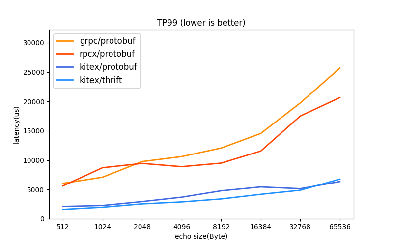
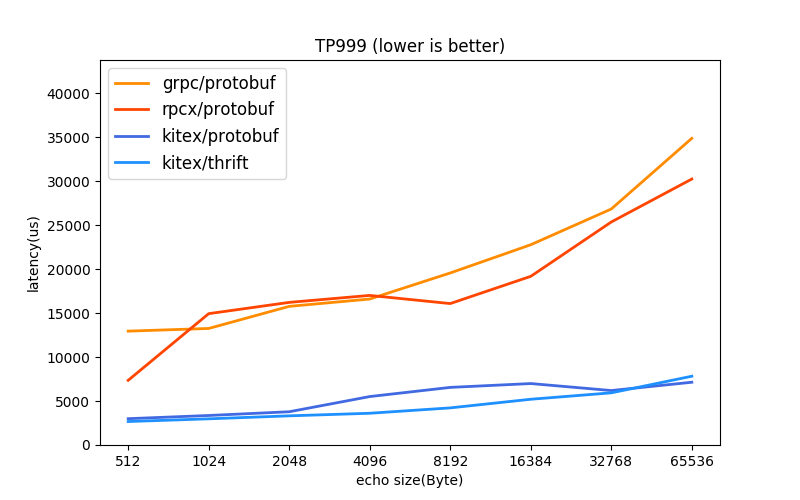

# CloudWeGo-Kitex

Kitex 字节跳动内部的 Golang 微服务 RPC 框架，具有**高性能**、**强可扩展**的特点，针对字节内部做了定制扩展。如今越来越多的微服务选择使用 Golang，我们考虑将 Kitex 开源出来丰富开源社区。如果对微服务性能有要求，又希望定制扩展融入自己的治理体系，Kitex 会是一个不错的选择。

## 框架特点

- **高性能**

  使用自研的高性能网络库 [Netpoll](https://github.com/cloudwego/netpoll)，性能相较 go net 具有显著优势。

- **扩展性**

  提供了较多的扩展接口以及默认扩展实现，使用者也可以根据需要自行定制扩展，具体见下面的框架扩展。

- **多消息协议**

  RPC 消息协议默认支持 **Thrift**、**Kitex Protobuf**、**gRPC**。Thrift 支持 Buffered 和 Framed 二进制协议；Kitex Protobuf 是 Kitex 自定义的 Protobuf 消息协议，协议格式类似 Thrift；gRPC 是对 gRPC 消息协议的支持，可以与 gRPC 互通。除此之外，使用者也可以扩展自己的消息协议。

- **多传输协议**

  传输协议封装消息协议进行 RPC 互通，传输协议可以额外透传元信息，用于服务治理，Kitex 支持的传输协议有 **TTHeader**、**HTTP2**。TTHeader 可以和 Thrift、Kitex Protobuf 结合使用；HTTP2 目前主要是结合 gRPC 协议使用，后续也会支持 Thrift。

- **多交互方式**

  支持 **PingPong**、**Oneway**、**双向 Streaming**。其中 Oneway 目前只对 Thrift 协议支持，双向 Streaming 只对 gRPC 支持，后续会考虑支持 Thrift 的双向 Streaming。

- **服务治理**

  支持服务注册/发现、负载均衡、熔断、限流、重试、监控、链路跟踪、日志、诊断等服务治理模块，大部分均已提供默认扩展，使用者可选择集成。

- **代码生成**

  Kitex 内置代码生成工具，可支持生成 **Thrift**、**Protobuf** 以及脚手架代码。

## 框架性能

性能测试只能提供相对参考，工业场景下，有诸多因素可以影响实际的性能表现。

由于开源社区缺少支持 thrift 的优秀 RPC 框架，当前对比项目为 [grpc](https://github.com/grpc/grpc), [rpcx](https://github.com/smallnest/rpcx), 均使用 protobuf 协议。

我们通过 [测试代码](https://github.com/cloudwego/kitex-benchmark) 比较了它们的性能，测试表明 [Kitex](https://github.com/cloudwego/kitex) 具有明显优势。

### 测试环境

* CPU:    Intel(R) Xeon(R) Gold 5118 CPU @ 2.30GHz, 4 cores
* Memory: 8GB
* OS:     Debian 5.4.56.bsk.1-amd64 x86_64 GNU/Linux
* Go:     1.15.4

### 并发表现 (Echo 1KB, 改变并发量)

| QPS                                                  |                         TP99                          |                         TP999                          |
| :--------------------------------------------------- | :---------------------------------------------------: | :----------------------------------------------------: |
|  |  |  |

### 吞吐表现 (并发 100, 改变包大小)

| QPS                                                |                        TP99                         |                        TP999                         |
| :------------------------------------------------- | :-------------------------------------------------: | :--------------------------------------------------: |
|  |  |  |

## 详细文档
  - [**快速开始**](docs/guide/getting_started_cn.md)

  - **用户指南**
    
    - 基本特性
    
      - [请求方式（PingPong、Oneway、Streaming）](docs/guide/basic-features/interaction_cn.md)
    
      - [支持协议（Thrift、Kitex Protobuf、gRPC protocol）](docs/guide/basic-features/protocols_cn.md)
    
      - [应用层传输协议 TTHeader](docs/guide/basic-features/ttheader_cn.md)
    
      - [直连访问](docs/guide/basic-features/visit_directly_cn.md)
    
      - [连接池](docs/guide/basic-features/connpool_cn.md)
    
      - [超时控制](docs/guide/basic-features/timeout_cn.md)
    
      - [请求重试](docs/guide/basic-features/retry_cn.md)
    
      - [负载均衡](docs/guide/basic-features/loadbalance_cn.md) 
    
      - [熔断](docs/guide/basic-features/circuitbreaker_cn.md)
    
      - [限流](docs/guide/basic-features/limiting_cn.md)
    
      - [埋点粒度控制](docs/guide/basic-features/tracing_cn.md)
    
      - [日志](docs/guide/basic-features/logging_cn.md)
      
      - [HttpResolver](docs/guide/basic-features/HTTP_resolver_cn.md)
    
    - 治理特性
      
      - [服务发现](docs/guide/service-government/discovery_cn.md)
      
      - [监控](docs/guide/service-government/monitoring_cn.md)
      
      - [链路跟踪](docs/guide/service-government/tracing_cn.md)
      
      - [自定义访问控制](docs/guide/service-government/access_control_cn.md)
      
    - 高级特性
    
      - [泛化调用](docs/guide/advanced-feature/TODO_cn.md)
    
      - [Server SDK 化](docs/guide/basic-features/invoker_cn.md)
    
    - 代码生成
    
      - [代码生成工具](docs/guide/basic-features/code_generation_cn.md)

      - [Combine Service](docs/guide/basic-features/combine_service_cn.md)
    
    - 框架扩展
    
      - [基本扩展 - 自定义Middleware](docs/guide/extension/middleware_cn.md)
    
      - [Suite 扩展（封装自定义治理模块）](docs/guide/extension/suite_cn.md)
    
      - [服务注册扩展](docs/guide/extension/registry_cn.md)
    
      - [服务发现扩展](docs/guide/extension/discovery_cn.md)
    
      - [负载均衡扩展](docs/guide/extension/loadbalance_cn.md)
    
      - [监控扩展](docs/guide/extension/monitoring_cn.md)
    
      - [日志扩展](docs/guide/basic-features/logging_cn.md)
    
      - [编解码(协议)扩展](docs/guide/extension/codec_cn.md)
    
      - [传输模块扩展](docs/guide/extension/transport_cn.md)
    
      - [Transport Pipeline-Bound扩展](docs/guide/extension/trans_pipeline_cn.md)
    
      - [元信息传递扩展](docs/guide/extension/transmeta_cn.md)
    
      - [诊断模块扩展](docs/guide/extension/diagnosis_cn.md)
    
  - **参考**

    - [异常说明](docs/reference/exception_cn.md)

    - [版本管理](docs/reference/version_cn.md)   

  - **FAQ**
## 相关项目
- [Netpoll](https://github.com/cloudwego/netpoll): 自研的高性能网络库，Kitex 默认集成的。
- [kitex-contrib](https://github.com/kitex-contrib)：Kitex 的部分扩展库，使用者可以根据需求通过 Option 集成进 Kitex 中。
- [Example](https://github.com/cloudwego/kitex-examples)：Kitex 的使用示例。

## 相关文章

- [字节跳动 Go RPC 框架 Kitex 性能优化实践](https://mp.weixin.qq.com/s/Xoaoiotl7ZQoG2iXo9_DWg)
- [字节跳动在 Go 网络库上的实践](https://mp.weixin.qq.com/s?__biz=MzI1MzYzMjE0MQ==&mid=2247485756&idx=1&sn=4d2712e4bfb9be27a790fa15159a7be1&chksm=e9d0c2dedea74bc8179af39888a5b2b99266587cad32744ad11092b91ec2e2babc74e69090e6&scene=21#wechat_redirect)

## 贡献代码

[Contributing](CONTRIBUTING.md)。

## 开源许可
Kitex 基于[Apache License 2.0](LICENSE) 许可证，其依赖的三方组件的开源许可见 [Licenses](licenses)。

## 联系我们
- Email: conduct@cloudwego.io
- Issues: [Issues](https://github.com/cloudwego/kitex/issues)
- 飞书用户群（[注册飞书](https://www.feishu.cn/)进群）

   

