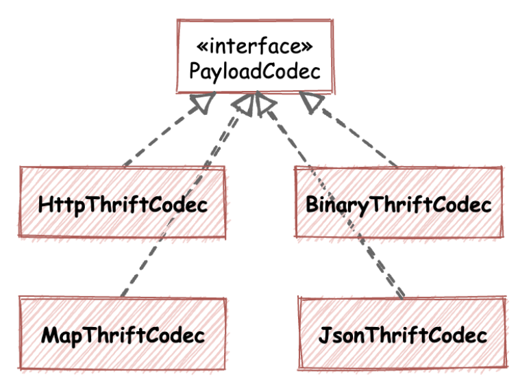

# 编解码 (协议) 扩展


Kitex 支持扩展协议，包括整体的 Codec 和 PayloadCodec。通常 RPC 协议中包含应用层传输协议和 Payload 协议，如 HTTP/HTTP2 属于应用层传输协议，基于 HTTP/HTTP2 可以承载不同格式和不同协议的 Payload，Kitex 默认支持内置的 TTHeader 传输协议，Payload 支持 Thrift 、KitexProtobuf、gRPC。Kitex 集成 nhttp2 支持 HTTP2，所以未对 HTTP2 单独扩展。

TTHeader 协议定义如下图，通过 TTHeader 可以透传服务信息，便于服务治理。

```
*  TTHeader Protocol
*  +-------------2Byte--------------|-------------2Byte-------------+
*  +----------------------------------------------------------------+
*  | 0|                          LENGTH                             |
*  +----------------------------------------------------------------+
*  | 0|       HEADER MAGIC          |            FLAGS              |
*  +----------------------------------------------------------------+
*  |                         SEQUENCE NUMBER                        |
*  +----------------------------------------------------------------+
*  | 0|     Header Size(/32)        | ...
*  +---------------------------------
*
*  Header is of variable size:
*  (and starts at offset 14)
*
*  +----------------------------------------------------------------+
*  | PROTOCOL ID  |NUM TRANSFORMS . |TRANSFORM 0 ID (uint8)|
*  +----------------------------------------------------------------+
*  |  TRANSFORM 0 DATA ...
*  +----------------------------------------------------------------+
*  |         ...                              ...                   |
*  +----------------------------------------------------------------+
*  |        INFO 0 ID (uint8)      |       INFO 0  DATA ...
*  +----------------------------------------------------------------+
*  |         ...                              ...                   |
*  +----------------------------------------------------------------+
*  |                                                                |
*  |                              PAYLOAD                           |
*  |                                                                |
*  +----------------------------------------------------------------+
```

## Codec 定义

Codec 接口定义如下：

```go
// Codec is the abstraction of the codec layer of Kitex.
type Codec interface {
	Encode(ctx context.Context, msg Message, out ByteBuffer) error

	Decode(ctx context.Context, msg Message, in ByteBuffer) error

	Name() string
}
```

Codec 是整体的编解码接口，结合需要支持的传输协议和 Payload 进行扩展，根据协议类型调用 PayloadCodec 接口，其中 Decode 需要进行协议探测判断传输协议和 Payload。Kitex 默认提供 defaultCodec 扩展实现。

## PayloadCodec 定义

PayloadCodec 接口定义如下：

```go
// PayloadCodec is used to marshal and unmarshal payload.
type PayloadCodec interface {
	Marshal(ctx context.Context, message Message, out ByteBuffer) error

	Unmarshal(ctx context.Context, message Message, in ByteBuffer) error

	Name() string
}
```

Kitex 默认支持的 Payload 有 Thrift、Kitex Protobuf 以及 gRPC 协议。其中 Kitex Protobuf 是 Kitex 基本 pb 定义的消息协议，协议定义与 Thrift Message 类似。

特别的，Kitex 的泛化调用也是通过扩展 PayloadCodec 实现：



## 指定自定义 Codec 和 PayloadCodec

通过 option 指定 Codec 和 PayloadCodec。

- 指定 Codec
  option: `WithCodec`

```go
// server side
svr := stservice.NewServer(handler, server.WithCodec(yourCodec))

// client side
cli, err := xxxservice.NewClient(targetService, client.WithCodec(yourCodec))

```

- 指定 PayloadCodec
  option: `WithPayloadCodec`

```go
// server side
svr := stservice.NewServer(handler, server.WitWithPayloadCodechCodec(yourPayloadCodec))

// client side
cli, err := xxxservice.NewClient(targetService, client.WithPayloadCodec(yourPayloadCodec))
```
