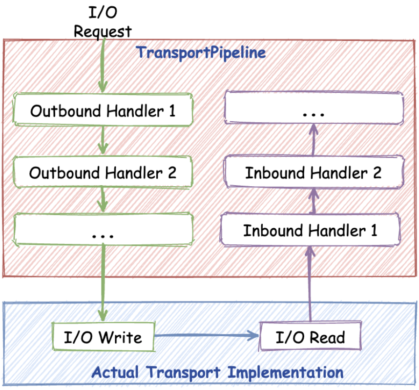

# Transport Pipeline-Bound 扩展


Transport Pipeline 参考 Netty ChannelPipeline，提供 Inbound 和 Outbound 接口，支持对消息或 I/O 事件扩展。基于 In/OutboundHandler 可以扩展实现 TLS、限流、透传消息处理等。如下图所示，各个 BoundHandler 会串行依次执行。



## 接口定义

```go
// OutboundHandler is used to process write event.
type OutboundHandler interface {
	Write(ctx context.Context, conn net.Conn, send Message) (context.Context, error)
}

// InboundHandler is used to process read event.
type InboundHandler interface {
	OnActive(ctx context.Context, conn net.Conn) (context.Context, error)

	OnInactive(ctx context.Context, conn net.Conn) context.Context

	OnRead(ctx context.Context, conn net.Conn) (context.Context, error)

	OnMessage(ctx context.Context, args, result Message) (context.Context, error)
}
```

### 默认扩展

- 服务端限流 Handler

  Kitex 支持连接级别和请求级别限流，限流是为了保障服务的可用性，当达到阈值应当及时限流，放到 Transport 层可以达到及时限流的目的，实现见 limiter_inbound.go。
  - 连接级别限流 OnActive(), OnInactive()
  - 请求级别限流 OnRead()

- 元信息透传 Handler

  元信息透传是基于传输协议透传一些 rpc 额外的信息给下游，同时读取传输协议中上游透传的信息，实现见 transmeta_bound.go。

  - 写入透传信息 Write()
  - 读取透传信息 OnMessage()

  为更明确的为使用者元信息透传的扩展能力，Kitex 单独定义了消息透传的处理接口 MetaHandler，这里会执行 MetaHandler 进行透传消息的处理。

## 指定自定义的 BoundHandler

- 服务端

  option: `WithBoundHandler`

  ```go
  svr := xxxservice.NewServer(handler, server.WithBoundHandler(yourBoundHandler))
  ```

- 调用端

  option: `WithBoundHandler`

  ```go
  cli, err := xxxservice.NewClient(targetService, client.WithBoundHandler(yourBoundHandler))
  ```
