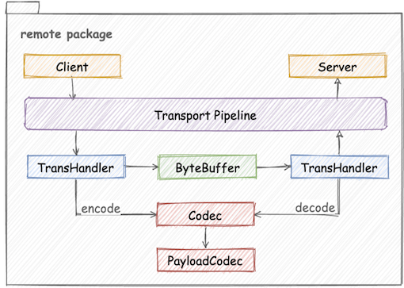
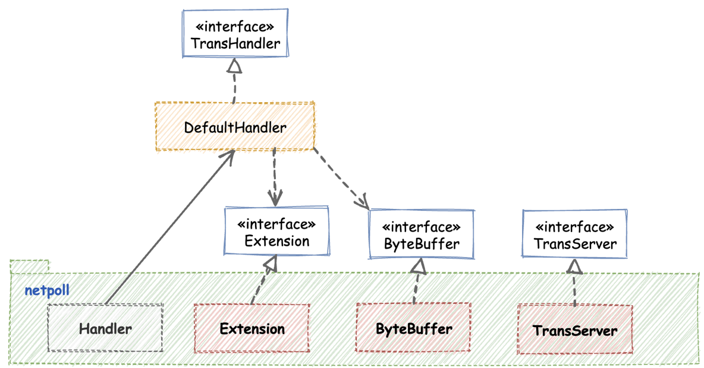

# Extension of Transport Module



By default, Kitex integrates the self-developed high-performance network library [Netpoll](https://github.com/cloudwego/netpoll). But Kitex is not strongly bound with Netpoll, it also supports users to extend other network libraries and choose one on demand. In addition, Kitex provides ShmIPC to further improve IPC performance, this extension will be open source later.

## Extension APIs

The main extension interfaces of transport module are as follows:

```go
type TransServer interface {...}

type ServerTransHandler interface {...}

type ClientTransHandler interface {...}

type ByteBuffer interface {...}

type Extension interface {...}

// -------------------------------------------------------------
// TransServerFactory is used to create TransServer instances.
type TransServerFactory interface {
	NewTransServer(opt *ServerOption, transHdlr ServerTransHandler) TransServer
}

// ClientTransHandlerFactory to new TransHandler for client
type ClientTransHandlerFactory interface {
	NewTransHandler(opt *ClientOption) (ClientTransHandler, error)
}

// ServerTransHandlerFactory to new TransHandler for server
type ServerTransHandlerFactory interface {
	NewTransHandler(opt *ServerOption) (ServerTransHandler, error)
}
```

`TransServer` is the startup interface of the server, `ServerTransHandler` and `ClientTransHandler` are the message processing interfaces of the server and client respectively, `ByteBuffer` is the read-write interface. Under the same IO model, the code logic of the `TransHandler` is usually consistent, so Kitex provides the default implementation of `TransHandler` for synchronous IO and abstracts the extension interface for different parts. Therefore, in the scene of synchronous IO, it is not necessary to implement the complete `TransHandler` interface, just implement the `Extension` API.

### Extension to Netpoll

Below figure is Kitex's extension to netpoll synchronous IO, which implements `Extension`, `ByteBuffer`, `TransServer` interfaces.



## Use Customized Transport Module

- Server Side

  option: `WithTransServerFactory`,  `WithTransHandlerFactory`

  ```go
  var opts []server.Option
  opts = append(opts, server.WithTransServerFactory(yourTransServerFactory)
  opts = append(opts, server.WithTransHandlerFactory(yourTransHandlerFactory)
                
  svr := xxxservice.NewServer(handler, opts...)
  ```

- Client Side

  option: `WithTransHandlerFactory`

  ```go
  cli, err := xxxservice.NewClient(targetService, client.WithTransHandlerFactory(yourTransHandlerFactory)
  ```
